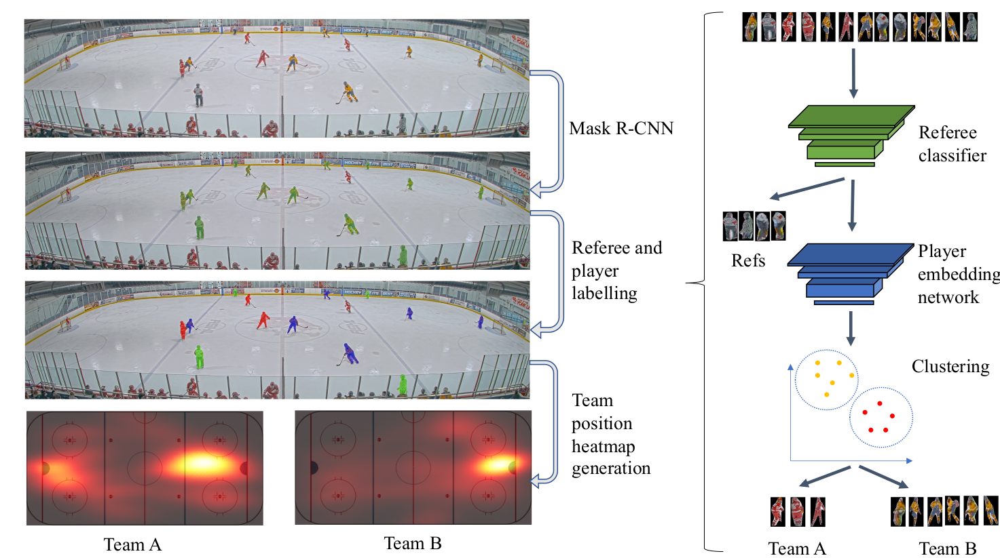

# Contrastive Learning for Sports Video: Unsupervised Player Classification
This repository provides code for our paper Contrastive Learning for Sports Video: Unsupervised Player Classification (Maria Koshkina, Hemanth Pidaparthy, James H. Elder).

## Publication
If you use this code or the dataset please cite:
(bibtex coming soon)

##Setup
1. Clone repository.
1. Install dependencies by running:

1. Download and unzip data into 'data' directory (download link coming soon). Our player classification code runs on player images segmented out from original video frames. Both frames and player images are included in the dataset.

1. Download pre-trained models into 'trained_models' directory (download link coming soon)

##Usage
To run evaluation of player clustering based on embedding features run:

'python test_with_players_only.py with method=net'

Alternatively, specify 'method=hist' (for histogram), 'method=bag' (for bag of colours), 'method=ae' (for autoencoder).
Refer to the paper for detailed method description.

##Code organization:
models.py - models for referee classifier, embedding network, autoencoder
embedding_network.py - training code for embedding network
referee_classifier.py - training and test for referee classifier
autoencoder.py - training for autoencoder
dataloader.py, utils.py - helper methods and constants
test_with_players_only.py - test player clustering using diffrerent features 

##Full workflow flow:
1) train referee classifier on the ground truth labels:
	'python referee_classifer.py'
2) for convenience, we ran the referee classifier on all segmented images to save a list of predicted players_only 
	'python referee_classifier.py --save'
3) using players_only images to train embedding network (and autoencoder for comparison); 
	'python embedding_network.py'
	'python autoencoder.py'
4) run experiments using embedding network, histogram, bag of colors, or autoencoder features:
	'python test_with_players_only.py with method=<method_name>'
where method_name is one of 'net', 'hist', 'bag', 'ae' 
